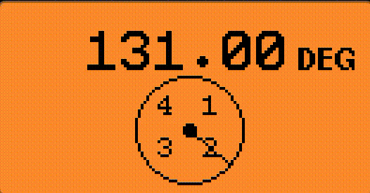
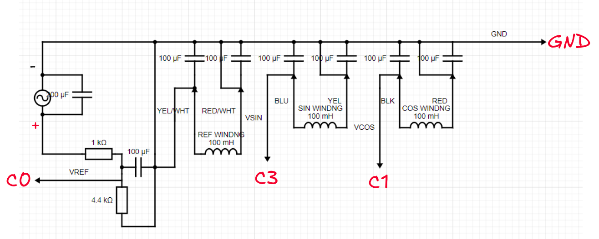

# Resolver Reader

This is janky-ass application reads SIN (C3), COS (C1), VREF (C0), GND (18)
wires from resolver and displays shaft angle based on measured COS, SIN values.

Excitation frequency is 10kHz another freq not tested.

Tested on Tamagawa TS2620N21E11 resolver, when COS or SIN winding approx 0V in
0$\degree$, 90$\degree$, etc. there some hysteresis due to ADC resolution
readings.



## Install

Builded on unlshd-079 firmware.
```
cd $FLIPPER_FIRMWARE_PATH/applications_user
git clone https://github.com/lalapopa/resolver-reader.git resolver_reader
cd ..
./fbt launch APPSRC=applications_user/resolver_reader
```

## Connection

Wire color corresponds to BRX series resolver. You need to limit VREF using voltage
divider based on your input voltage (1 kOhm and 4.4 kOhm resistor for 3-4V VREF).



## P.S

This is only for educational purpose, in real production use COTS RDC that
handles calculation of angle (e.g ADS2S1205/10).

